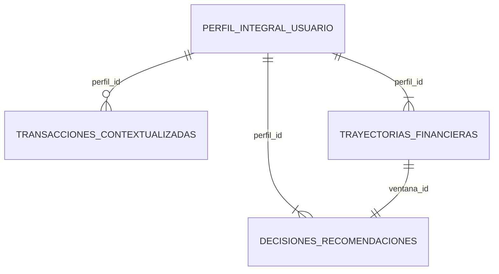

# Datasets sintéticos de FinCoach

Esta carpeta contiene los cuatro datasets construidos por el equipo de datos para entrenar, evaluar y validar la propuesta de FinCoach.

Los registros son completamente sintéticos: no representan clientes ni transacciones de personas reales. Su propósito es proporcionar un entorno controlado, reproducible y trazable para desarrollar el MVP de ciencia de datos.

## Resumen

| Dataset | Filas | Columnas | Unidad de análisis | Uso principal |
|---|---:|---:|---|---|
| `perfil_integral_usuario.csv` | 200 | 58 | Un perfil financiero sintético | Conocimiento y clasificación del usuario |
| `transacciones_contextualizadas.csv` | 17.284 | 47 | Un movimiento financiero | Categoría, finalidad, confirmación y regularidad |
| `trayectorias_financieras.csv` | 600 | 60 | Una ventana financiera de un perfil | Indicadores y estados de trayectoria |
| `decisiones_recomendaciones.csv` | 600 | 28 | Una recomendación asociada a una ventana | Entrenamiento del motor de recomendaciones |

Todos los archivos utilizan:

- Formato CSV.
- Codificación UTF-8.
- Separador por coma.
- Pesos colombianos (`COP`) como moneda.
- Identificadores sintéticos para conservar la relación entre tablas.

## ¿Por qué se construyeron datos sintéticos?

Para este MVP se eligieron datos sintéticos porque permiten:

- Evitar el uso de información financiera personal o sensible.
- Representar escenarios que serían difíciles de obtener en una fuente pública única.
- Controlar la relación entre perfil, transacciones, trayectoria y recomendación.
- Incluir casos con ingresos fijos, variables, mixtos, estacionales, apoyos y ausencia de ingresos.
- Incorporar gastos esenciales, hobbies, inversión productiva, deuda y movimientos ambiguos.
- Crear particiones reproducibles de entrenamiento, validación y prueba.
- Evaluar casos de confirmación y abstención de manera intencional.

Los nombres y códigos ocupacionales toman como referencia la Clasificación Única de Ocupaciones para Colombia (CUOC). Esta referencia se utiliza para estructurar el catálogo cerrado de actividades, no significa que los perfiles procedan de registros personales de una entidad.

## Relación entre los datasets

Las relaciones se construyen de la siguiente manera:

- `perfil_id` identifica al mismo perfil en los cuatro archivos.
- Cada perfil tiene múltiples transacciones.
- Cada perfil tiene tres ventanas financieras acumuladas.
- Cada `ventana_id` tiene exactamente una decisión o recomendación asociada.
- La partición asignada al perfil se conserva en sus transacciones, ventanas y decisiones.

La auditoría actual no encontró perfiles ni ventanas sin correspondencia entre los archivos.

## 1. `perfil_integral_usuario.csv`

### Propósito

Representa el contexto declarado y la situación financiera inicial de 200 usuarios sintéticos. Es la fuente principal para el notebook de conocimiento del usuario y aporta contexto al clasificador de transacciones.

### Alcance ocupacional

El catálogo incluye diez familias de actividad, con 20 perfiles por familia:

- Agricultura.
- Ciclismo competitivo.
- Diseño audiovisual y edición de video.
- Docencia y formación.
- Domicilios, mensajería y reparto.
- Ingeniería y desarrollo de software.
- Música y entretenimiento DJ.
- Nutrición y dietética.
- Peluquería y barbería.
- Ventas al por menor.

Una actividad que no alcance la confianza mínima dentro de estas familias debe considerarse fuera del alcance del MVP.

### Hobbies incluidos

El catálogo cerrado contiene:

- Ciclismo.
- Cocina y repostería.
- Fotografía y video.
- Impresión 3D.
- Jardinería y agricultura urbana.
- Manualidades y artesanías.
- Música.
- Pintura.
- Turismo y viajes.
- Videojuegos y streaming.

### Contextos financieros representados

| Estado de ingreso | Perfiles |
|---|---:|
| Fijo | 50 |
| Variable | 50 |
| Mixto | 40 |
| Apoyo | 20 |
| Estacional | 20 |
| Sin ingresos | 20 |

El ingreso mensual neto se encuentra entre `0` y `11.181.000` COP. Los 20 casos con ingreso igual a cero son intencionales y permiten validar que el sistema no invente capacidad de pago.

El hábito de ahorro se distribuye entre `nunca`, `baja`, `media` y `alta`. También se incluyen actividades adicionales, metas, responsabilidades, personas a cargo, tipos de deuda, liquidez inicial y deuda inicial cuando corresponden.

### Grupos de campos

| Grupo | Campos representativos | Utilidad |
|---|---|---|
| Identificación y versión | `perfil_id`, `version_perfil`, `vigencia_desde`, `huella_registro` | Trazabilidad del perfil |
| Alcance | `pais`, `moneda`, `estado_alcance_mvp`, `nivel_informacion_visible` | Control del MVP y contexto general |
| Actividad principal | Campos con prefijo `actividad_1_` | Familia, código CUOC, denominación, rol y modalidad |
| Actividad secundaria | Campos con prefijo `actividad_2_` | Segundo ingreso o actividad declarada |
| Ingresos | `estado_ingreso_actual`, `ingreso_mensual_neto`, `modalidad_ingreso_principal`, `ingreso_adicional` | Contexto económico declarado |
| Contexto personal declarado | `hobby_1`, `hobby_2`, `objetivo_proximo`, `responsabilidad_financiera` | Personalización sin inventar información |
| Situación financiera inicial | `liquidez_inicial`, `deuda_inicial`, `tipos_deuda`, `nivel_endeudamiento_pct`, `habito_ahorro` | Punto de partida del análisis |
| Gobierno del dato | `particion`, `es_sintetico`, `version_esquema`, `consentimiento_analisis` | Separación experimental y trazabilidad |

Los campos vacíos son válidos cuando el perfil no declara actividad secundaria, meta, responsabilidad, deuda u otro dato opcional.

## 2. `transacciones_contextualizadas.csv`

### Propósito

Contiene 17.284 movimientos asociados a los 200 perfiles durante el periodo comprendido entre el 1 de abril y el 30 de junio de 2026.

Este dataset permite entrenar y evaluar:

- La categoría financiera.
- La finalidad del movimiento.
- La necesidad de confirmación.
- La regularidad financiera.

### Composición general

| Dirección | Movimientos |
|---|---:|
| Salidas | 14.831 |
| Entradas | 2.453 |

Existen 199 descripciones normalizadas diferentes y montos entre `13.000` y `7.397.000` COP.

La regularidad se distribuye así:

| Regularidad | Movimientos | Aplicación |
|---|---:|---|
| Variable | 9.897 | Ingresos o gastos cuyo valor, fecha o decisión puede cambiar |
| Fijo | 7.138 | Compromisos o entradas periódicas previsibles |
| Estacional | 249 | Exclusivamente ingresos asociados a temporadas |

Una transacción recurrente no se considera automáticamente fija. Por ejemplo, supermercado o transporte pueden repetirse y continuar siendo gastos variables.

### Categorías financieras

El catálogo contiene 20 categorías:

- Alimentación.
- Apoyos recibidos.
- Deuda y financiación.
- Deuda y financiación recibida.
- Devoluciones y reembolsos.
- Educación.
- Ingresos laborales.
- Inversión productiva.
- Ocio.
- Otra / ambigua.
- Otros recursos recibidos.
- Rentas y rendimientos.
- Salud.
- Servicios.
- Trabajo independiente.
- Transferencias y apoyo.
- Transporte.
- Ventas y actividad comercial.
- Vestimenta.
- Vivienda.

Además de la categoría principal, el dataset conserva finalidades como consumo personal, consumo mixto, hobby, laboral, generación de ingreso, pago de deuda, apoyo o liquidez financiada.

### Confirmación y ambigüedad

- 16.726 movimientos están etiquetados como clasificables sin confirmación adicional.
- 558 movimientos representan casos ambiguos o que requieren confirmación.
- `categoria_confirmada_usuario` y `regularidad_confirmada_usuario` conservan la referencia de una decisión controlada.
- `evidencia_contextual` y `motivo_confirmacion` explican por qué una clasificación puede necesitar revisión.

### Historial para fijo y variable

Las columnas incorporadas para la clasificación de regularidad son:

- `ocurrencias_previas_90d`.
- `meses_previos_con_movimiento`.
- `dias_desde_movimiento_similar`.
- `variacion_valor_previa_pct`.
- `historial_regularidad_disponible`.
- `criterio_regularidad`.
- `fuente_regularidad`.

Estas variables permiten separar la repetición observada de la naturaleza financiera del movimiento.

### Grupos de campos

| Grupo | Campos representativos | Utilidad |
|---|---|---|
| Identificación | `transaccion_id`, `perfil_id`, `version_perfil_aplicada`, `fecha` | Relación con usuario y orden temporal |
| Movimiento declarado | `descripcion_original`, `descripcion_normalizada`, `valor`, `moneda`, `direccion`, `canal` | Entrada principal del clasificador |
| Objetivos | `categoria_principal`, `finalidad`, `regularidad_movimiento`, `requiere_confirmacion` | Variables que aprenden los modelos |
| Contexto | `relacion_actividad`, `relacion_hobby`, `meta_relacionada`, `nota_usuario` | Desambiguación según el perfil |
| Revisión | `estado_clasificacion`, `motivo_confirmacion`, `confianza_objetivo`, `etiqueta_revisada` | Control de incertidumbre |
| Historial | Campos de ocurrencias, meses, días y variación previa | Evidencia para fijo, variable o estacional |
| Gobierno del dato | `particion`, `es_sintetico`, `version_taxonomia`, `version_esquema`, `huella_registro` | Reproducibilidad y control de versiones |

## 3. `trayectorias_financieras.csv`

### Propósito

Resume el comportamiento financiero de cada perfil en ventanas acumuladas. Es la fuente del modelo que clasifica el estado de trayectoria financiera.

Cada uno de los 200 perfiles tiene tres ventanas:

| Tipo de ventana | Registros |
|---|---:|
| Acumulada de 30 días | 200 |
| Acumulada de 61 días | 200 |
| Acumulada de 91 días | 200 |

### Estados de trayectoria

El catálogo contiene siete estados:

- `acumulacion_estable`.
- `deterioro_reciente`.
- `equilibrio_sostenible`.
- `fragilidad_sostenida`.
- `situacion_critica`.
- `uso_planificado_reserva`.
- `variable_resiliente`.

El estado describe una ventana financiera observada y no una identidad permanente de la persona.

### Indicadores incluidos

| Grupo | Campos representativos | Utilidad |
|---|---|---|
| Ventana | `ventana_id`, `perfil_id`, `periodo_desde`, `periodo_hasta`, `dias_observados` | Delimitar la evidencia temporal |
| Ingresos | `ingresos_generados`, `apoyos_recibidos`, `prestamos_recibidos`, `ingresos_fijos`, `ingresos_variables`, `ingresos_estacionales` | Comprender el origen de los recursos |
| Gastos | `gastos_totales`, `gastos_esenciales`, `gastos_hobbies`, `inversion_productiva`, `gastos_fijos`, `gastos_variables` | Comprender el destino del dinero |
| Liquidez y deuda | `liquidez_inicial`, `liquidez_final`, `deuda_inicial`, `deuda_final`, `pagos_capital`, `pagos_intereses`, `nueva_deuda` | Medir evolución de recursos y obligaciones |
| Indicadores del modelo | `actividad_A`, `balance_operativo_B`, `presion_deficit_Q`, `caida_maxima_M`, `recuperacion_R`, `variabilidad_ingresos_V`, `cobertura_esencial_L_meses`, `dependencia_externa_X` | Variables de la clasificación de trayectoria |
| Resultado y explicación | `estado_trayectoria`, `estado_calculo`, `factores_positivos`, `factores_atencion`, `explicacion_periodo` | Objetivo y trazabilidad del estado |
| Gobierno del dato | `particion`, `es_sintetico`, `version_metodologia`, `version_esquema`, `huella_registro` | Reproducibilidad |

Las 600 ventanas actuales tienen `estado_calculo` igual a `calculado`. La aplicación real, sin embargo, puede devolver evidencia insuficiente cuando el historial no alcanza los mínimos requeridos.

## 4. `decisiones_recomendaciones.csv`

### Propósito

Asocia una recomendación controlada a cada una de las 600 ventanas financieras. Se utiliza para entrenar el motor de recomendaciones después de obtener el estado de trayectoria.

El catálogo cerrado contiene once recomendaciones:

- `REC_APARTAR_PARA_META`.
- `REC_BUSCAR_APOYO_Y_CONTENER`.
- `REC_CREAR_RESPALDO`.
- `REC_CUIDAR_MARGEN`.
- `REC_CUIDAR_MARGEN_CON_DEUDA`.
- `REC_CUIDAR_RECURSOS_SIN_INGRESO`.
- `REC_ENTENDER_CAMBIO_RECIENTE`.
- `REC_GUARDAR_EN_MESES_ALTOS`.
- `REC_MEDIR_USO_DE_RESERVA`.
- `REC_PROTEGER_ESENCIALES`.
- `REC_PROTEGER_ESENCIALES_Y_DEUDA`.

La recomendación final no depende únicamente de la probabilidad del modelo. Las condiciones de exclusión y las guardas de protección tienen prioridad cuando existe riesgo de emitir una sugerencia incompatible con el contexto observado.

### Grupos de campos

| Grupo | Campos representativos | Utilidad |
|---|---|---|
| Identificación | `decision_id`, `perfil_id`, `ventana_id`, `fecha_decision` | Relación con perfil y trayectoria |
| Objetivo del modelo | `recomendacion_id`, `recomendacion`, `tipo_recomendacion` | Clase y texto amigable de la recomendación |
| Contexto protegido | `meta_relacionada`, `hobbies_considerados`, `aspectos_protegidos` | Evitar recomendaciones desconectadas del usuario |
| Evidencia y exclusión | `condiciones_observadas`, `condiciones_exclusion`, `evidencia_utilizada`, `riesgo_si_se_aplica` | Justificación y guardas |
| Acción | `decision`, `prioridad`, `requiere_confirmacion`, `revision_humana` | Forma de presentar o revisar la recomendación |
| Explicación | `razon_decision`, `pregunta_contextual_si_aplica` | Trazabilidad del resultado |
| Gobierno del dato | `particion`, `es_sintetico`, `version_catalogo`, `version_esquema`, `huella_registro` | Reproducibilidad |

En el conjunto actual, 239 decisiones requieren revisión humana, 139 la recomiendan y 222 no la requieren.

## Particiones experimentales

Las particiones se asignaron por perfil para evitar que información de una misma persona sintética aparezca simultáneamente en entrenamiento y evaluación.

| Dataset | Train | Validation | Test |
|---|---:|---:|---:|
| Perfiles | 140 | 30 | 30 |
| Transacciones | 12.131 | 2.529 | 2.624 |
| Trayectorias | 420 | 90 | 90 |
| Decisiones | 420 | 90 | 90 |

La diferencia en el número de transacciones por partición se debe a que cada perfil puede tener una cantidad distinta de movimientos. Las ventanas y decisiones mantienen tres registros por perfil.

## Variables objetivo por notebook

| Notebook | Dataset principal | Variables objetivo o resultado esperado |
|---|---|---|
| `01_conocimiento_usuario.ipynb` | Perfiles | `actividad_1_familia` y alcance del catálogo |
| `02_clasificacion_transacciones.ipynb` | Perfiles + transacciones | `categoria_principal`, `finalidad`, `regularidad_movimiento` y confirmación |
| `03_patrones_temporales.ipynb` | Transacciones | Recurrencias, tendencias y eventos inusuales observados |
| `04_trayectoria_indicadores_y_estados.ipynb` | Trayectorias | `estado_trayectoria` |
| `05_motor_recomendaciones.ipynb` | Trayectorias + decisiones + perfiles | `recomendacion_id` |
| `06_validacion_end_to_end.ipynb` | Los cuatro datasets | Compatibilidad y trazabilidad del pipeline completo |

## Calidad y trazabilidad

La revisión actual confirma:

- Cero filas completamente duplicadas en los cuatro datasets.
- 200 identificadores de perfil únicos.
- 17.284 identificadores de transacción únicos.
- 600 identificadores de ventana únicos.
- 600 identificadores de decisión únicos.
- Ninguna transacción, trayectoria o decisión referencia un perfil inexistente.
- Ninguna decisión referencia una ventana inexistente.
- Las particiones son consistentes entre los archivos relacionados.
- Los campos monetarios y temporales necesarios para el pipeline tienen valores válidos.

La columna `huella_registro` proporciona una referencia de integridad para cada fila. Las columnas de versión permiten identificar la taxonomía, el esquema o la metodología utilizada para construirla.

## Cómo ampliar los datasets

Los archivos pueden crecer con más filas sin modificar los notebooks siempre que se conserve el contrato actual. Al agregar información se debe:

1. Mantener exactamente los nombres y tipos de las columnas.
2. Crear identificadores únicos para perfiles, transacciones, ventanas y decisiones.
3. Conservar las relaciones mediante `perfil_id` y `ventana_id`.
4. Asignar una sola partición a cada perfil y repetirla en todos sus registros relacionados.
5. Evitar que un perfil aparezca en más de una partición.
6. Mantener `es_sintetico`, las versiones y la huella de trazabilidad.
7. Distinguir los campos realmente ausentes de los valores cero.
8. Regenerar las trayectorias y decisiones si se modifican las transacciones.
9. Ejecutar nuevamente el notebook 00 antes de entrenar.
10. Reentrenar los modelos afectados y finalizar con la validación del notebook 06.

Agregar nuevas ocupaciones, hobbies, categorías, estados o recomendaciones sí amplía el alcance del MVP y puede requerir cambios en los catálogos, pruebas, modelos y documentación.

## Consideraciones éticas

- Ningún registro debe presentarse como información de una persona real.
- La ocupación, los hobbies o el nivel de ingreso no deben utilizarse para definir el valor o la identidad de una persona.
- Un gasto puede tener finalidades diferentes dependiendo del contexto declarado.
- La recurrencia no convierte automáticamente un gasto en fijo.
- Un estado financiero describe un periodo, no una condición permanente.
- Las recomendaciones deben proteger necesidades esenciales y abstenerse cuando falte evidencia.
- La confirmación o corrección del usuario debe conservarse como parte de la trazabilidad.

Estos datasets sirven exclusivamente como base controlada para el MVP y para demostrar el funcionamiento de los modelos propuestos por el equipo de datos.