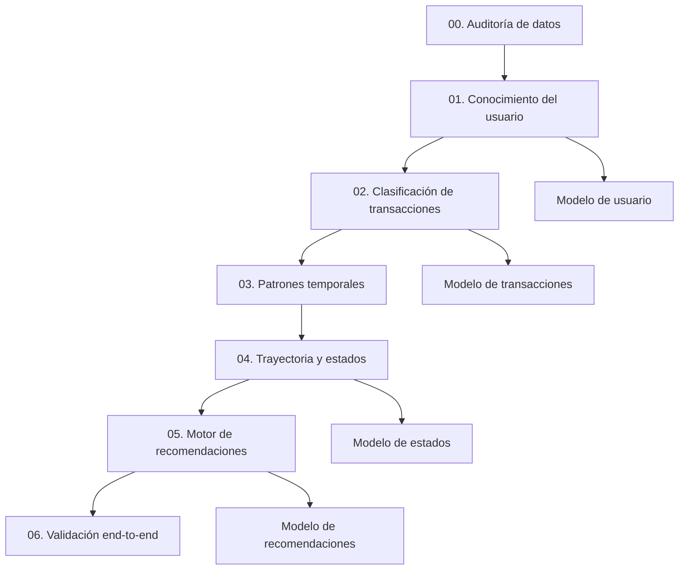

# Notebooks de FinCoach

Esta carpeta documenta el proceso de ciencia de datos propuesto para el MVP de FinCoach. El trabajo está dividido en siete notebooks que deben ejecutarse en orden, desde la auditoría de los datos sintéticos hasta la validación integral del pipeline.

Los notebooks permiten reproducir los controles, entrenamientos, métricas, tablas y gráficas que respaldan los artefactos ubicados en `Modelos/` y `Resultados/`. No representan una solución universal: trabajan con los catálogos cerrados y las condiciones documentadas para este MVP.

## Resumen del flujo



## Orden de ejecución

| Orden | Notebook | Función principal | ¿Entrena? |
|---:|---|---|---|
| 1 | `00_auditoria_y_eda_datos.ipynb` | Auditar calidad, integridad, alcance y particiones | No |
| 2 | `01_conocimiento_usuario.ipynb` | Reconocer el contexto declarado del usuario dentro del MVP | Sí |
| 3 | `02_clasificacion_transacciones.ipynb` | Clasificar categoría, finalidad, regularidad y necesidad de confirmación | Sí |
| 4 | `03_patrones_temporales.ipynb` | Detectar recurrencias, tendencias y eventos inusuales | No |
| 5 | `04_trayectoria_indicadores_y_estados.ipynb` | Clasificar el estado financiero de cada ventana temporal | Sí |
| 6 | `05_motor_recomendaciones.ipynb` | Generar recomendaciones restringidas por evidencia y guardas | Sí |
| 7 | `06_validacion_end_to_end.ipynb` | Validar contratos y ejecutar casos integrales sin reentrenar | No |

No se recomienda ejecutar los notebooks de forma aislada. Desde el `02`, cada etapa consume modelos o resultados generados anteriormente.

## Estructura esperada

Los notebooks usan rutas relativas. Para que funcionen sin modificaciones, la estructura debe mantenerse así:

```text
FinCoach/
├── Datasets/
│   ├── perfil_integral_usuario.csv
│   ├── transacciones_contextualizadas.csv
│   ├── trayectorias_financieras.csv
│   └── decisiones_recomendaciones.csv
├── Modelos/
├── Notebooks/
│   ├── 00_auditoria_y_eda_datos.ipynb
│   ├── 01_conocimiento_usuario.ipynb
│   ├── 02_clasificacion_transacciones.ipynb
│   ├── 03_patrones_temporales.ipynb
│   ├── 04_trayectoria_indicadores_y_estados.ipynb
│   ├── 05_motor_recomendaciones.ipynb
│   └── 06_validacion_end_to_end.ipynb
└── Resultados/
    └── Graficas/
```

`Modelos/`, `Resultados/` y `Resultados/Graficas/` se crean desde los notebooks cuando es necesario.

## Preparación del entorno

Se recomienda utilizar un entorno virtual propio para los notebooks. Desde la raíz del proyecto:

```bash
python3 -m venv env
source env/bin/activate
python -m pip install --upgrade pip
python -m pip install jupyterlab ipykernel pandas numpy matplotlib scikit-learn joblib
python -m ipykernel install --user --name fincoach-notebooks --display-name 'Python FinCoach'
```

Después, ingresar a la carpeta de notebooks y levantar JupyterLab:

```bash
cd Notebooks
jupyter lab
```

En JupyterLab se debe seleccionar el kernel `Python FinCoach`. Cada notebook también incluye al inicio una celda `%pip install` para instalar sus dependencias en el kernel activo cuando haga falta.

Las bibliotecas principales son:

- `pandas`: carga, validación y transformación tabular.
- `numpy`: operaciones numéricas y reproducibilidad.
- `scikit-learn`: entrenamiento, evaluación y pipelines.
- `matplotlib`: gráficas de exploración y validación.
- `joblib`: serialización de los artefactos entrenados.

## 00 — Auditoría y EDA de los datos

Archivo: `00_auditoria_y_eda_datos.ipynb`

### Objetivo

Comprobar que los cuatro datasets cumplen el contrato mínimo antes de entrenar. Si un control crítico falla, el flujo debe detenerse y corregirse desde los datos.

### Entradas

- `perfil_integral_usuario.csv`.
- `transacciones_contextualizadas.csv`.
- `trayectorias_financieras.csv`.
- `decisiones_recomendaciones.csv`.

### Trabajo realizado

- Verifica la existencia y el tamaño mínimo de los archivos.
- Revisa esquemas, campos obligatorios, tipos, faltantes y duplicados.
- Comprueba los diez perfiles ocupacionales y los hobbies admitidos por el MVP.
- Audita ingresos, deudas, transacciones y contexto financiero.
- Distingue recurrencia temporal de regularidad financiera.
- Verifica que las particiones `train`, `validation` y `test` no mezclen perfiles.
- Calcula huellas de integridad y relaciones entre datasets.
- Revisa distribuciones, pares contrafactuales y reconciliación de ventanas.
- Impide que columnas objetivo o metadatos de generación se usen como entradas del modelo.

### Salida

No genera un modelo. Su salida principal es una tabla final de aceptación con los controles que habilitan o bloquean el resto del proceso.

## 01 — Conocimiento del usuario

Archivo: `01_conocimiento_usuario.ipynb`

### Objetivo

Estructurar el contexto declarado por el usuario y reconocer su actividad principal dentro de las diez familias ocupacionales admitidas por el MVP.

### Entrada

- `perfil_integral_usuario.csv`.

### Trabajo realizado

- Valida el contrato estructurado y las particiones del dataset.
- Construye los catálogos cerrados de actividades, ocupaciones CUOC, hobbies y modalidades de ingreso.
- Compara regresión logística y Naive Bayes complementario para la actividad principal.
- Combina la probabilidad del modelo con la similitud frente al catálogo conocido.
- Conserva los datos declarados de ingresos, hobbies, metas, responsabilidades y deudas sin inventar información ausente.
- Marca explícitamente actividades o hobbies fuera del alcance del MVP.
- Evalúa el modelo con particiones separadas y matriz de confusión.

### Salida

- `../Modelos/01_conocimiento_usuario.joblib`.

El artefacto contiene el modelo seleccionado, catálogos, variantes conocidas, umbrales, campos esperados y metadatos de versión.

### Pruebas manuales

Las últimas celdas incluyen:

- Casos clasificables dentro del MVP.
- Un caso fuera del MVP para verificar la abstención.

## 02 — Clasificación contextual de transacciones

Archivo: `02_clasificacion_transacciones.ipynb`

### Objetivo

Clasificar cada movimiento utilizando tanto sus datos como el contexto previamente estructurado del usuario. Una misma compra puede recibir interpretaciones diferentes según su finalidad y el perfil asociado.

### Entradas

- `perfil_integral_usuario.csv`.
- `transacciones_contextualizadas.csv`.
- `../Modelos/01_conocimiento_usuario.joblib`.

### Trabajo realizado

- Une cada transacción con el contexto de su perfil sin utilizar columnas objetivo como atributos.
- Construye variables de texto, valor, proporción del ingreso e historial anterior.
- Compara modelos para seleccionar la categoría principal.
- Entrena modelos independientes para finalidad y necesidad de confirmación.
- Ajusta el umbral de confirmación con la partición de validación.
- Entrena la regularidad por separado para gastos e ingresos:
  - Gastos: `fijo` o `variable`.
  - Ingresos: `fijo`, `variable` o `estacional`.
- Usa únicamente historial anterior para las variables de regularidad.
- Devuelve porcentajes por categoría y puede abstenerse cuando la evidencia no es suficiente.

### Salida

- `../Modelos/02_clasificacion_transacciones.joblib`.

El artefacto contiene los modelos de categoría, finalidad, confirmación y regularidad, además de umbrales, clases, contratos y metadatos de versión.

### Pruebas manuales

Las últimas celdas prueban:

- Categorías conocidas.
- Gastos fijos y variables.
- Ingresos fijos, variables y estacionales.
- Una transacción ambigua que debe solicitar confirmación.

## 03 — Patrones temporales

Archivo: `03_patrones_temporales.ipynb`

### Objetivo

Describir el comportamiento observado en el tiempo sin tratar la repetición como prueba automática de que un gasto es fijo.

### Entradas

- `perfil_integral_usuario.csv`.
- `transacciones_contextualizadas.csv`.
- `../Modelos/02_clasificacion_transacciones.joblib`.

### Trabajo realizado

- Verifica cobertura y calidad de las fechas.
- Detecta recurrencias según cadencias observadas.
- Calcula tendencias semanales por perfil y categoría.
- Identifica eventos inusuales comparándolos únicamente con el historial propio del usuario.
- Genera visualizaciones de evolución semanal y recurrencias por categoría.

### Salidas

- `../Resultados/03_recurrencias_observadas.csv`.
- `../Resultados/03_tendencias_observadas.csv`.
- `../Resultados/03_eventos_inusuales.csv`.
- `../Resultados/Graficas/03_evolucion_semanal_perfil.png`.
- `../Resultados/Graficas/03_recurrencias_por_categoria.png`.

### Pruebas manuales

Las últimas celdas comprueban recurrencias mensuales, historias irregulares y casos con evidencia temporal insuficiente.

## 04 — Trayectoria, indicadores y estados

Archivo: `04_trayectoria_indicadores_y_estados.ipynb`

### Objetivo

Construir indicadores por ventana temporal y clasificar el estado financiero observado. El estado describe un periodo, no define a la persona de manera permanente.

### Entradas

- `perfil_integral_usuario.csv`.
- `transacciones_contextualizadas.csv`.
- `trayectorias_financieras.csv`.
- Los tres CSV generados por el notebook `03`.

### Trabajo realizado

- Audita fórmulas de liquidez, deuda, gastos y cobertura.
- Prepara indicadores normalizados y contexto financiero permitido.
- Mantiene la separación de perfiles entre entrenamiento, validación y prueba.
- Compara regresión logística y bosque aleatorio.
- Selecciona el modelo mediante `f1_macro` y `balanced_accuracy` de validación.
- Evalúa una sola vez sobre la partición de prueba.
- Aplica umbrales mínimos de evidencia y confianza.
- Integra recurrencias, tendencias y eventos como información descriptiva.
- Genera gráficas de trayectoria, distribución de estados, importancia y matriz de confusión.

### Salidas

- `../Modelos/04_estados_trayectoria.joblib`.
- `../Resultados/04_estados_por_ventana.csv`.
- `../Resultados/04_estados_trayectoria.csv`.
- `../Resultados/04_metricas_modelo.csv`.
- `../Resultados/Graficas/04_matriz_confusion_estados.png`.
- `../Resultados/Graficas/04_importancia_indicadores.png`.
- `../Resultados/Graficas/04_trayectoria_liquidez_deuda.png`.
- `../Resultados/Graficas/04_distribucion_estados_actuales.png`.

### Pruebas manuales

Las últimas celdas incluyen una trayectoria con ingreso variable resiliente, uso planificado de una reserva y un caso con evidencia insuficiente.

## 05 — Motor restringido de recomendaciones

Archivo: `05_motor_recomendaciones.ipynb`

### Objetivo

Generar recomendaciones comprensibles dentro de un catálogo cerrado, dando prioridad a las guardas de evidencia sobre la probabilidad estadística.

### Entradas

- `decisiones_recomendaciones.csv`.
- `trayectorias_financieras.csv`.
- `perfil_integral_usuario.csv`.
- `../Modelos/04_estados_trayectoria.joblib`.
- Resultados de estados generados por el notebook `04`.

### Trabajo realizado

- Une decisiones, estados e indicadores mediante claves trazables.
- Audita la cobertura del catálogo de once recomendaciones.
- Compara regresión logística y bosque aleatorio.
- Selecciona y evalúa el modelo con particiones separadas.
- Aplica guardas de cobertura, confianza, vulnerabilidad y revisión humana.
- Puede abstenerse cuando los datos no respaldan una recomendación.
- Genera textos amigables, motivos, prioridades y porcentajes de confianza.

### Salidas

- `../Modelos/05_motor_recomendaciones.joblib`.
- `../Resultados/05_recomendaciones.csv`.
- `../Resultados/05_metricas_modelo.csv`.
- `../Resultados/Graficas/05_matriz_confusion_recomendaciones.png`.
- `../Resultados/Graficas/05_distribucion_recomendaciones.png`.

### Pruebas manuales

Las últimas celdas prueban una trayectoria estable, un escenario frágil con deuda y un caso con evidencia insuficiente.

## 06 — Validación end-to-end

Archivo: `06_validacion_end_to_end.ipynb`

### Objetivo

Comprobar que los datos, modelos y resultados anteriores son compatibles y que el flujo completo conserva sus contratos, guardas y trazabilidad.

### Entradas

- Los cuatro datasets sintéticos.
- Los cuatro artefactos `joblib`.
- Los resultados generados por los notebooks `03`, `04` y `05`.

### Trabajo realizado

- Carga los artefactos existentes sin volver a entrenarlos.
- Verifica archivos, versiones, claves y contratos entre etapas.
- Audita controles éticos, alcance cerrado, abstención y evidencia mínima.
- Integra conocimiento del usuario, clasificación de movimientos, patrones, trayectoria y recomendación.
- Ejecuta casos representativos del flujo completo.
- Consolida métricas y genera gráficas finales de cobertura y confianza.

### Salidas

- `../Resultados/06_trazabilidad_perfiles.csv`.
- `../Resultados/06_controles_pipeline.csv`.
- `../Resultados/06_casos_validacion.csv`.
- `../Resultados/06_metricas_componentes.csv`.
- `../Resultados/Graficas/06_cobertura_pipeline.png`.
- `../Resultados/Graficas/06_confianza_casos_integrales.png`.

### Pruebas manuales

Las últimas celdas validan un caso estable, un caso vulnerable, una entrada fuera del MVP y la integración de la regularidad financiera.

## Artefactos entrenados

El proceso completo genera cuatro archivos en `Modelos/`:

| Artefacto | Notebook responsable | Uso |
|---|---|---|
| `01_conocimiento_usuario.joblib` | `01` | Conocer y delimitar el contexto declarado del usuario |
| `02_clasificacion_transacciones.joblib` | `02` | Clasificar movimientos y determinar si requieren confirmación |
| `04_estados_trayectoria.joblib` | `04` | Clasificar estados financieros por ventana |
| `05_motor_recomendaciones.joblib` | `05` | Generar recomendaciones bajo guardas |

Los archivos `joblib` solo deben cargarse desde una fuente confiable. También deben utilizarse con versiones compatibles de Python y Scikit-Learn. Ante cambios importantes de dependencias o del contrato de datos, lo correcto es regenerarlos ejecutando nuevamente los notebooks.

## Reproducibilidad y evaluación

- Los notebooks utilizan una semilla fija para reducir variaciones entre ejecuciones.
- Las particiones se encuentran definidas en los datasets y separadas por perfil.
- `train` se utiliza para aprender los parámetros.
- `validation` se utiliza para comparar candidatos y seleccionar umbrales.
- `test` se reserva para la evaluación final.
- Las métricas principales incluyen `accuracy`, `balanced_accuracy`, `f1_macro` y `log_loss`, según el notebook.
- Las matrices de confusión y las pruebas manuales complementan las métricas agregadas.
- Una precisión alta dentro de los datos sintéticos no demuestra cobertura sobre casos reales o fuera del catálogo.

## Actualización del flujo

Si se agregan filas manteniendo exactamente las mismas columnas y contratos:

1. Reemplazar o ampliar los CSV dentro de `Datasets/`.
2. Ejecutar el notebook `00` y resolver cualquier control fallido.
3. Ejecutar nuevamente los notebooks del `01` al `06` en orden.
4. Revisar las métricas y pruebas manuales antes de reemplazar modelos en otros componentes.
5. Copiar a la API únicamente los artefactos aprobados y compatibles con su contrato.

Si se agregan columnas, clases, profesiones, hobbies, categorías, estados o recomendaciones, no basta con volver a ejecutar. En ese caso deben revisarse los contratos, catálogos, funciones de preparación, variables de entrada, guardas, pruebas y consumidores de cada artefacto.

## Consideraciones del MVP

- Los modelos fueron entrenados con datos sintéticos y catálogos deliberadamente limitados.
- La clasificación del usuario parte de información declarada y estructurada.
- El contexto del usuario influye en la clasificación de una transacción, pero no justifica inventar su finalidad.
- La recurrencia temporal y la regularidad financiera son conceptos diferentes.
- Las salidas deben conservar porcentajes, motivos y estados de confirmación o abstención.
- Las recomendaciones no sustituyen asesoría financiera profesional.
- Los resultados describen la evidencia disponible y deben poder ser confirmados o corregidos por el usuario.
