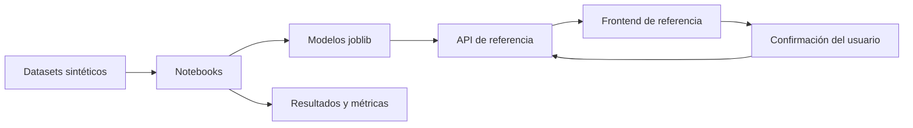

# FinCoach — Base propuesta por el equipo de datos

Este directorio reúne la solución propuesta por el equipo de datos desarrollada para FinCoach

Su objetivo es entregar una base reproducible para continuar mejorando el procesamiento de datos, los modelos entrenados y su integración con la aplicación.

## ¿Qué contiene esta propuesta?

- Cuatro datasets construidos de manera sintética.
- Siete notebooks que documentan el proceso de ciencia de datos.
- Cuatro artefactos `joblib` generados por los entrenamientos.
- Métricas, validaciones, tablas y gráficas obtenidas durante la ejecución.
- API de referencia desarrollada con Django REST Framework.
- Frontend de referencia desarrollado con Angular.

El back y el front permiten demostrar qué información esperan los modelos, qué resultados producen y cómo podrían integrarse en un flujo funcional. Estos componentes son una guía, la cual debe adaptarse o reemplazarse según las decisiones finales.

## Objetivo del trabajo de datos

El trabajo se concentra en transformar información estructurada en resultados que puedan ser consumidos por otros componentes del proyecto:

- Reconocer el contexto declarado por el usuario dentro del alcance del MVP.
- Clasificar ingresos y gastos utilizando el contexto del usuario.
- Diferenciar gastos fijos y variables.
- Identificar recurrencias, tendencias y eventos inusuales.
- Construir indicadores de trayectoria financiera.
- Generar estados y recomendaciones sustentados en la evidencia disponible.
- Abstenerse o solicitar confirmación cuando la evidencia no sea suficiente.

## Alcance del MVP de datos

La propuesta trabaja con catálogos cerrados de ocupaciones, hobbies, categorías financieras, estados y recomendaciones. No representa todas las profesiones, actividades económicas o situaciones financieras posibles.

Cuando una entrada está fuera del catálogo o no alcanza la confianza mínima, la salida debe indicarlo de forma explícita. La confirmación del usuario se conserva como parte del proceso para no tratar una predicción como una verdad absoluta.

Los datasets son sintéticos y no contienen información financiera personal real. Los modelos fueron entrenados localmente con Scikit-Learn y se serializaron como archivos `joblib`.

## Flujo de la propuesta



La parte central y reutilizable de esta propuesta se encuentra en los datasets, los notebooks, los modelos y sus contratos de entrada y salida. La API y el frontend muestran una forma posible de llevar esos resultados a una aplicación.

## Estructura del directorio

```text
FinCoach/
├── Datasets/                Datos sintéticos utilizados en el MVP
├── Modelos/                 Artefactos joblib generados por los notebooks
├── Notebooks/               Proceso de ciencia de datos dividido en siete etapas
├── Resultados/              Métricas, validaciones, tablas y gráficas
├── back/
│   └── fincoach_api/        API de referencia para integrar y probar los modelos
├── front/
│   └── fincoach/            Interfaz de referencia para recorrer el flujo
└── README.md                Mapa general de la propuesta
```

La API utiliza una copia de los modelos dentro de `back/fincoach_api/joblibs/`. Los archivos originales generados por los notebooks permanecen en `Modelos/`.

## Notebooks

Los notebooks deben ejecutarse en el siguiente orden:

1. `00_auditoria_y_eda_datos.ipynb`: audita los datasets y realiza la exploración inicial.
2. `01_conocimiento_usuario.ipynb`: entrena y valida la clasificación del contexto del usuario.
3. `02_clasificacion_transacciones.ipynb`: clasifica categoría, finalidad y regularidad de los movimientos.
4. `03_patrones_temporales.ipynb`: identifica recurrencias, tendencias y eventos inusuales.
5. `04_trayectoria_indicadores_y_estados.ipynb`: construye indicadores y estados financieros por ventana.
6. `05_motor_recomendaciones.ipynb`: genera recomendaciones limitadas por evidencia y guardas.
7. `06_validacion_end_to_end.ipynb`: comprueba la compatibilidad y el recorrido integral del pipeline.

El proceso genera cuatro modelos:

- `01_conocimiento_usuario.joblib`.
- `02_clasificacion_transacciones.joblib`.
- `04_estados_trayectoria.joblib`.
- `05_motor_recomendaciones.joblib`.

## Implementación de referencia

Para facilitar las pruebas y mostrar la integración de los modelos, este directorio también incluye:

- Una API REST con perfiles, transacciones, deudas, dashboard, análisis financiero y recomendaciones.
- Documentación OpenAPI.
- Una colección de Postman con ejemplos de consumo.
- Una interfaz Angular que recorre el flujo desde el registro hasta las recomendaciones.
- Persistencia local con SQLite para las pruebas del MVP.

Esta implementación sirve como demostración técnica y como referencia para trasladar los contratos de los modelos al proyecto.

## Tecnologías utilizadas en esta base

| Área | Tecnologías |
|---|---|
| Procesamiento y entrenamiento | Python, Pandas, NumPy y Scikit-Learn |
| Experimentación | JupyterLab |
| Serialización | Joblib |
| API de referencia | Django REST Framework |
| Documentación de la API | OpenAPI mediante drf-spectacular |
| Frontend de referencia | Angular, TypeScript, Tailwind CSS y Chart.js |
| Persistencia local | SQLite |

## Consideraciones y limitaciones

- Esta carpeta representa una base propuesta de flujo a nivel de datos.
- Los catálogos están limitados deliberadamente para construir un MVP verificable.
- Los resultados describen periodos y comportamientos observados, no definen permanentemente a una persona.
- Las recomendaciones están restringidas al catálogo entrenado y pueden abstenerse por falta de evidencia.
- Las clasificaciones confirmadas o corregidas por los usuarios conservan trazabilidad y pueden apoyar futuros reentrenamientos.