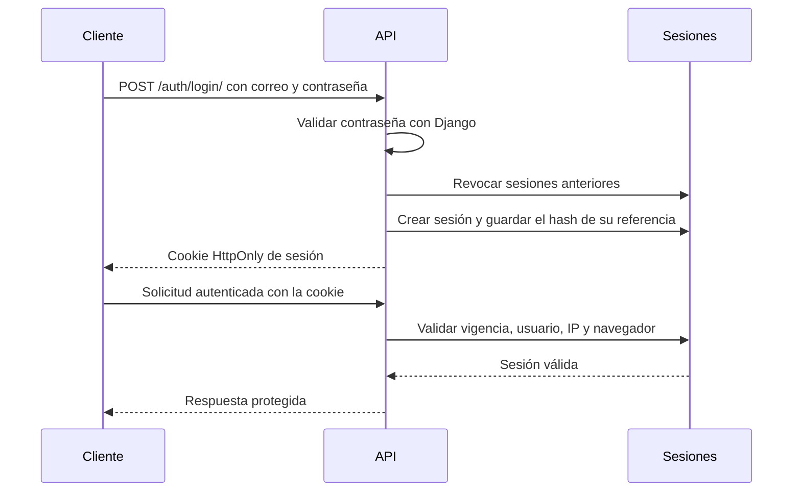

  # API de referencia de FinCoach

Esta carpeta contiene la API REST donde se abordan los aspectos asociados a ciencia de datos para demostrar cómo integrar los modelos de FinCoach con una aplicación web.

La implementación expone contratos funcionales para el uso de perfiles, movimientos, deudas, dashboard, análisis financiero y recomendaciones.

## ¿Qué permite probar?

- Registro, inicio y cierre.
- Consulta del usuario.
- Creación y actualización del perfil financiero.
- Ejecución del modelo de conocimiento del usuario.
- Registro, clasificación, confirmación y corrección de movimientos.
- Clasificación de gastos fijos y variables e ingresos fijos, variables o estacionales.
- Resúmenes y análisis mensuales.
- Exportación de movimientos como CSV.
- Registro, cálculo y seguimiento de deudas.
- Asociación de pagos confirmados con una deuda.
- Cálculo del estado financiero y generación de recomendaciones.

## Tecnologías

| Tecnología | Uso |
|---|---|
| Python | Lenguaje principal |
| Django 6 | Aplicación, ORM, administración y sesiones |
| Django REST Framework | Endpoints, serialización y permisos |
| Scikit-Learn | Ejecución de los modelos entrenados |
| Joblib | Carga de los artefactos de los notebooks |
| Pandas y NumPy | Preparación de entradas e indicadores |
| drf-spectacular | Esquema OpenAPI y Swagger UI |
| python-decouple | Variables de configuración |
| SQLite | Persistencia local |
| MySQL | Motor previsto en la configuración de producción |

## Estructura

```text
back/
├── Fincoach.postman_collection.json
├── requirements.txt
├── README.md
└── fincoach_api/
    ├── accounts/
    ├── profiles/
    ├── transactions/
    ├── dashboard/
    ├── debts/
    ├── recommendations/
    ├── financial_analysis/
    ├── fincoach_api/
    ├── joblibs/
    ├── .env
    └── manage.py
```

## Responsabilidad de cada app

| App | Responsabilidad |
|---|---|
| `accounts` | Usuario por correo, registro, login, logout, sesiones y controles de seguridad |
| `profiles` | Datos declarados, clasificación del usuario y persistencia de su perfil |
| `transactions` | Historial, clasificación contextual, regularidad y confirmación del usuario |
| `dashboard` | Totales, composiciones, alertas, análisis mensual, paginación y CSV |
| `debts` | Créditos, cuotas, intereses, saldos, pagos y evolución proyectada |
| `recommendations` | Estado de trayectoria y recomendación restringida por evidencia |
| `financial_analysis` | Integración del análisis financiero correspondiente a un mes |

Las apps `dashboard`, `recommendations` y `financial_analysis` calculan respuestas a partir de otros registros y servicios. No necesitan tablas propias en la implementación actual.

## Requisitos

- Python compatible con las versiones registradas en `requirements.txt`.
- pip.
- Los cuatro artefactos `joblib` dentro de `fincoach_api/joblibs/`.

Para producción con MySQL también se requiere instalar y configurar un controlador compatible. El archivo `requirements.txt` actual contiene las dependencias utilizadas localmente, pero no incluye un controlador de MySQL ni un servidor WSGI/ASGI de producción.

## Instalación local

Desde la raíz del proyecto:

```bash
cd back
python3 -m venv venv
source venv/bin/activate
python -m pip install --upgrade pip
python -m pip install -r requirements.txt
```

Después se ingresa al proyecto Django:

```bash
cd fincoach_api
```

## Configuración del entorno

El archivo `.env` debe ubicarse al mismo nivel de `manage.py`:

```text
back/fincoach_api/.env
```

### Desarrollo local

Para trabajar con SQLite y `DEBUG=True`:

```env
DJANGO_ENV=local
```

`DEBUG` no se define en `.env`. `settings.py` lo establece automáticamente según `DJANGO_ENV`.

### Producción

La configuración espera las siguientes variables:

```env
DJANGO_ENV=production
DJANGO_SECRET_KEY=<clave-secreta-larga-y-unica>
DJANGO_ALLOWED_HOSTS=api.ejemplo.com
FINCOACH_ALLOWED_ORIGINS=https://app.ejemplo.com
DB_NAME=<base-de-datos>
DB_USER=<usuario>
DB_PASSWORD=<contraseña>
DB_HOST=<host-mysql>
DB_PORT=3306
```

Los valores separados por comas son admitidos en `DJANGO_ALLOWED_HOSTS` y `FINCOACH_ALLOWED_ORIGINS`.

No se deben subir `.env`, credenciales ni bases de datos locales al repositorio. El `.gitignore` del proyecto excluye `.env`, `db.sqlite3`, cachés y archivos estáticos recolectados.

## Preparación de la base de datos

Con el entorno virtual activo y dentro de `back/fincoach_api/`:

```bash
python manage.py migrate
python manage.py createsuperuser
```

El usuario administrativo inicia sesión con correo electrónico, no con `username`.

Para ejecutar la API:

```bash
python manage.py runserver 0.0.0.0:8000
```

La API queda disponible localmente en:

```text
http://localhost:8000/api/v1/
```

El administrador se encuentra en:

```text
http://localhost:8000/admin/
```

## Autenticación

La API no utiliza JWT. La autenticación se basa en una única cookie de sesión emitida y validada por Django.

### Flujo



### Duración

- La sesión expira después de 8 horas de inactividad.
- Cada solicitud válida renueva el periodo de inactividad.
- Existe un límite absoluto de 24 horas desde el login.
- Un nuevo login revoca las sesiones anteriores del mismo usuario.
- El logout revoca el registro del servidor y elimina la cookie.

### Controles aplicados

- Contraseñas procesadas con los validadores y el hash de Django.
- Cookie `HttpOnly` y `SameSite=Strict`.
- Cookie `Secure` en producción.
- Identificador de sesión completo no almacenado en `UserSession`, se conserva su hash.
- Validación de dirección IP y `User-Agent` durante la sesión.
- Respuestas de API con `Cache-Control: no-store`.
- Solicitudes de escritura restringidas a `application/json`.
- Validación de origen y `Sec-Fetch-Site`.
- HTTPS obligatorio, HSTS y encabezados seguros en producción.
- Una única sesión activa por usuario.

La vinculación con IP y `User-Agent` reduce la reutilización de una cookie interceptada, pero un cambio legítimo de red o navegador puede cerrar la sesión. Este comportamiento debe reevaluarse según la infraestructura y la experiencia de usuario requeridas en producción.

### Encabezado de seguridad

Todas las operaciones `POST`, `PUT`, `PATCH` y `DELETE` deben incluir:

```http
X-FinCoach-Request: 1
Content-Type: application/json
```

`X-FinCoach-Request` no identifica al usuario y no reemplaza la cookie. Es una capa adicional para distinguir solicitudes de escritura esperadas por la aplicación.

Los endpoints de registro y login no necesitan una sesión previa, pero sí requieren el encabezado en sus solicitudes `POST`.

## Rutas y operaciones

La API contiene 15 rutas funcionales que representan 18 operaciones HTTP.

### Autenticación

| Método | Endpoint | Sesión | Función |
|---|---|---|---|
| `POST` | `/api/v1/auth/register/` | No | Registrar un usuario que acepta el tratamiento de datos |
| `POST` | `/api/v1/auth/login/` | No | Validar credenciales y crear la sesión |
| `GET` | `/api/v1/auth/me/` | Sí | Validar la sesión y devolver el usuario autenticado |
| `POST` | `/api/v1/auth/logout/` | Sí | Revocar la sesión actual |

### Perfil financiero

| Método | Endpoint | Sesión | Función |
|---|---|---|---|
| `POST` | `/api/v1/profiles/` | Sí | Crear y clasificar el perfil financiero |
| `GET` | `/api/v1/profiles/me/` | Sí | Consultar datos declarados y clasificación propia |
| `PATCH` | `/api/v1/profiles/me/` | Sí | Actualizar y volver a clasificar el perfil |

El perfil solicita ingreso mensual neto, hábito de ahorro, endeudamiento, actividad, modalidades de ingreso, objetivo, hobbies y responsabilidad financiera. El ingreso puede ser `0` y las validaciones se adaptan a las modalidades sin ingresos.

### Movimientos

| Método | Endpoint | Sesión | Función |
|---|---|---|---|
| `GET` | `/api/v1/transactions/` | Sí | Listar el historial del usuario |
| `POST` | `/api/v1/transactions/` | Sí | Registrar un movimiento pendiente |
| `POST` | `/api/v1/transactions/{id}/classify/` | Sí | Ejecutar la clasificación contextual |
| `PATCH` | `/api/v1/transactions/{id}/confirm/` | Sí | Confirmar o corregir la sugerencia |

El listado acepta los parámetros:

| Parámetro | Uso |
|---|---|
| `month=YYYY-MM` | Filtrar por mes |
| `direction=entrada` o `salida` | Filtrar ingresos o egresos |
| `status` | Filtrar por estado de clasificación |
| `page` | Número de página |
| `page_size` | Registros por página, entre 1 y 100 |

El flujo de un movimiento es:

```text
pending_classification → awaiting_confirmation → confirmed
```

El cuerpo de confirmación debe incluir las categorías elegidas, porcentajes que sumen `100` y la regularidad seleccionada. `selected_purpose` es opcional cuando se conserva la finalidad propuesta.

Ejemplo:

```json
{
  "selected_categories": [
    {
      "category": "Alimentación",
      "percentage": 100
    }
  ],
  "selected_regularity": "variable"
}
```

El mismo endpoint permite corregir una transacción ya confirmada. La API conserva la primera decisión, el historial de revisiones, la fuente y el número de correcciones.

### Dashboard y análisis mensual

| Método | Endpoint | Sesión | Función |
|---|---|---|---|
| `GET` | `/api/v1/dashboard/` | Sí | Totales, composiciones, alertas y evolución mensual |
| `GET` | `/api/v1/monthly-analysis/` | Sí | Resumen y transacciones del mes, siete por página |
| `GET` | `/api/v1/monthly-analysis/export/` | Sí | Descargar todas las transacciones confirmadas del mes como CSV UTF-8 |

Los tres endpoints aceptan `month=YYYY-MM`. Si no se envía, utilizan el mes actual. `monthly-analysis` también acepta `page`.

Los totales de gastos fijos y variables se calculan con la regularidad final confirmada de cada transacción, no únicamente con su categoría.

### Deudas

| Método | Endpoint | Sesión | Función |
|---|---|---|---|
| `GET` | `/api/v1/debts/` | Sí | Consultar saldos, cuotas, pagos y evolución |
| `POST` | `/api/v1/debts/` | Sí | Registrar una deuda y calcular su cuota |

Los tipos admitidos son:

- `housing`.
- `educational`.
- `credit_card`.
- `vehicle`.
- `personal`.

El registro solicita tipo, monto original, plazo en meses y fecha de inicio. Las tasas efectivas anuales utilizadas por el MVP están definidas en el backend según el tipo de deuda, el frontend solo muestra los valores devueltos por la API.

### Pago de una deuda

No existe un endpoint independiente para crear `DebtPayment`. Un pago se registra mediante el flujo de movimientos:

1. `POST /api/v1/transactions/` para registrar el egreso.
2. `POST /api/v1/transactions/{id}/classify/` para obtener la sugerencia.
3. `PATCH /api/v1/transactions/{id}/confirm/` para confirmar `Deuda y financiación` y enviar `selected_debt_id`.

Ejemplo de confirmación:

```json
{
  "selected_categories": [
    {
      "category": "Deuda y financiación",
      "percentage": 100
    }
  ],
  "selected_regularity": "fijo",
  "selected_debt_id": 2
}
```

Al confirmar, la API crea o actualiza la asociación `DebtPayment`. Solo los movimientos confirmados y vinculados descuentan del saldo de la deuda.

### Recomendaciones y análisis integral

| Método | Endpoint | Sesión | Función |
|---|---|---|---|
| `GET` | `/api/v1/recommendations/` | Sí | Calcular el estado financiero y la recomendación actual |
| `POST` | `/api/v1/financial-analysis/` | Sí | Unificar el análisis del mes seleccionado |

El análisis integral acepta un cuerpo opcional con el mes:

```json
{
  "month": "2026-08"
}
```

Cuando no existe evidencia suficiente, los servicios responden con un estado explícito de insuficiencia en lugar de forzar una clasificación o recomendación.

## Modelos `joblib`

La API consume cuatro artefactos ubicados en `back/fincoach_api/joblibs/`:

| Archivo | Servicio consumidor | Función |
|---|---|---|
| `01_conocimiento_usuario.joblib` | `profiles` | Clasificar el contexto declarado del usuario |
| `02_clasificacion_transacciones.joblib` | `transactions` | Clasificar categoría, finalidad, confirmación y regularidad |
| `04_estados_trayectoria.joblib` | `recommendations` | Calcular el estado de trayectoria financiera |
| `05_motor_recomendaciones.joblib` | `recommendations` | Seleccionar una recomendación bajo guardas |

`financial_analysis` integra los resultados de dashboard y recomendaciones, no carga un quinto modelo.

### Actualizar los modelos

Después de ejecutar y aprobar los notebooks:

1. Verificar las métricas y pruebas del pipeline.
2. Copiar los cuatro archivos aprobados desde `Modelos/` hacia `back/fincoach_api/joblibs/`.
3. Mantener exactamente los nombres esperados.
4. Ejecutar migraciones si cambió algún contrato persistido.
5. Ejecutar toda la suite de pruebas de la API.
6. Probar manualmente perfil, movimientos, estados y recomendaciones.

Los servicios validan la versión y las claves principales de los artefactos. Si el contrato no coincide, la API rechaza el modelo en lugar de utilizarlo parcialmente.

Los archivos `joblib` pueden ejecutar código durante su carga. Solo deben copiarse y cargarse artefactos generados por una fuente confiable y compatibles con las versiones de Python y Scikit-Learn instaladas.

## Base de datos

Las entidades persistidas son:

| Modelo | Contenido |
|---|---|
| `Usuario` | Nombre, apellido, correo, contraseña protegida y aceptación de datos |
| `UserSession` | Hash de sesión, vigencia, estado, IP, navegador y motivo de cierre |
| `FinancialProfile` | Datos declarados, clasificación, porcentajes y versión del modelo |
| `Transaction` | Movimiento, sugerencia, resultado confirmado y trazabilidad de decisiones |
| `Debt` | Tipo, monto, plazo, tasa, cuota y fechas |
| `DebtPayment` | Asociación entre una deuda y una transacción confirmada |

En local se utiliza `db.sqlite3`. Este archivo está ignorado por Git y no debe considerarse una fuente compartida de datos. La estructura reproducible se conserva mediante las migraciones.

## Administrador de Django

El panel permite revisar:

- Usuarios.
- Sesiones activas, revocadas o expiradas.
- Perfiles financieros y resultados del modelo.
- Movimientos y sus clasificaciones.
- Deudas.
- Pagos asociados a deudas.

El administrador sirve para inspección y pruebas del MVP. No reemplaza los permisos ni las pantallas de operación que requiera una solución productiva.

## Swagger y OpenAPI

Con el servidor activo:

| Recurso | Dirección |
|---|---|
| Swagger UI | `http://localhost:8000/api/docs/` |
| Esquema OpenAPI | `http://localhost:8000/api/schema/` |

Swagger muestra cuerpos, parámetros, respuestas y ejemplos. Para probar operaciones de escritura:

1. Abrir `/api/docs/`.
2. Ejecutar el endpoint de registro o login.
3. Incluir `X-FinCoach-Request: 1` en los endpoints que lo solicitan.
4. Mantener habilitadas las cookies del navegador.
5. Ejecutar los endpoints protegidos desde la misma pestaña y origen.

Swagger y el esquema son públicos en la configuración actual para facilitar la evaluación técnica. En una implementación productiva debe decidirse si se mantienen públicos, se protegen o se deshabilitan.

Para validar y exportar el esquema desde consola:

```bash
python manage.py spectacular --validate --file schema.yml
```

## Colección de Postman

La colección se encuentra en:

```text
back/Fincoach.postman_collection.json
```

Después de importarla en Postman, configurar:

```text
base_url = http://localhost:8000/api/v1
```

La colección incluye variables para `transaction_id` y `transaction_deuda`. Se recomienda ejecutar las carpetas en este orden:

1. Accounts.
2. Profiles.
3. Transacciones.
4. Dashboard.
5. Deudas.
6. Recomendaciones.

Postman conserva automáticamente la cookie recibida en el login. Si se eliminan sus cookies, los endpoints protegidos responderán como una sesión inexistente o expirada y será necesario iniciar sesión otra vez.

Para confirmar o corregir un movimiento se debe reemplazar la variable correspondiente con el identificador real devuelto al registrarlo.

## Pruebas

Con el entorno activo y dentro de `back/fincoach_api/`:

```bash
python manage.py check
python manage.py test
```

La suite cubre:

- Registro, login, sesión, expiración y logout.
- Protección de endpoints y encabezados requeridos.
- Creación, consulta y actualización del perfil.
- Contratos y errores de los modelos.
- Registro, clasificación, confirmación y corrección de transacciones.
- Regularidad de movimientos.
- Totales, filtros, paginación y exportación del dashboard.
- Registro, cálculo y pagos de deudas.
- Estados, recomendaciones y análisis integral.

Algunas pruebas fuerzan errores de modelo y escriben su traza en consola para comprobar el manejo de excepciones. Si el resultado final termina en `OK`, esas trazas esperadas no representan un fallo de la suite.

## Flujo de validación recomendado

1. Ejecutar `python manage.py migrate`.
2. Ejecutar `python manage.py check`.
3. Ejecutar `python manage.py test`.
4. Iniciar el servidor.
5. Probar el login y el perfil desde Postman o Swagger.
6. Registrar, clasificar y confirmar movimientos clasificables y ambiguos.
7. Verificar gastos fijos y variables en el dashboard.
8. Registrar una deuda y asociarle un pago confirmado.
9. Comparar meses con y sin evidencia previa.
10. Revisar estados de recomendación disponible e insuficiente.

## Producción

La rama `production` de configuración activa:

- `DEBUG=False`.
- Variables sensibles externas.
- MySQL.
- Cookies seguras.
- Redirección a HTTPS.
- HSTS.
- Validación estricta de hosts y orígenes.
- Directorio para archivos estáticos recolectados.

Antes de desplegar se debe completar como mínimo:

```bash
python manage.py check --deploy
python manage.py collectstatic --noinput
```

También se debe:

- Instalar un controlador de MySQL compatible.
- Elegir y configurar un servidor WSGI o ASGI de producción.
- Ubicar Django detrás de un proxy inverso con HTTPS.
- Definir secretos fuera del repositorio.
- Configurar copias de seguridad, registros y monitoreo.
- Revisar el tratamiento de IP cuando existan proxies.
- Definir si Swagger estará disponible públicamente.
- Ejecutar migraciones y pruebas sobre un ambiente previo al productivo.

No se debe utilizar `runserver` como servidor de producción.

## Problemas frecuentes

### `no such table`

Faltan migraciones en la base local:

```bash
python manage.py migrate
```

### `The session is invalid or has expired`

La cookie falta, fue revocada, superó su vigencia o cambió la IP o el navegador asociado. Se debe iniciar sesión nuevamente y permitir que el cliente conserve la cookie.

### `The required request security header was not found`

Agregar en la solicitud de escritura:

```http
X-FinCoach-Request: 1
```

### `Only application/json requests are accepted`

Enviar el cuerpo como JSON y utilizar:

```http
Content-Type: application/json
```

### El perfil o la clasificación indican que el modelo no está disponible

Verificar que los cuatro archivos existan en `fincoach_api/joblibs/`, que no estén dañados, que su versión corresponda al contrato esperado y que las dependencias coincidan con las utilizadas al entrenarlos.

### Django rechaza el host al probar desde otro dispositivo

El host debe estar incluido en `ALLOWED_HOSTS`. En producción se configura mediante `DJANGO_ALLOWED_HOSTS`. Cualquier ajuste local debe limitarse a la IP concreta del equipo y no utilizar `'*'`.

## Alcance de esta implementación

La API demuestra cómo consumir los artefactos construidos por los notebooks, conservar las decisiones del usuario y producir respuestas para el frontend de referencia.

Los modelos trabajan con datos sintéticos y catálogos cerrados. Sus porcentajes no deben interpretarse como certezas universales ni como asesoría financiera profesional. Cuando la evidencia no es suficiente, el sistema debe abstenerse, solicitar confirmación o indicar que el caso está fuera del MVP.