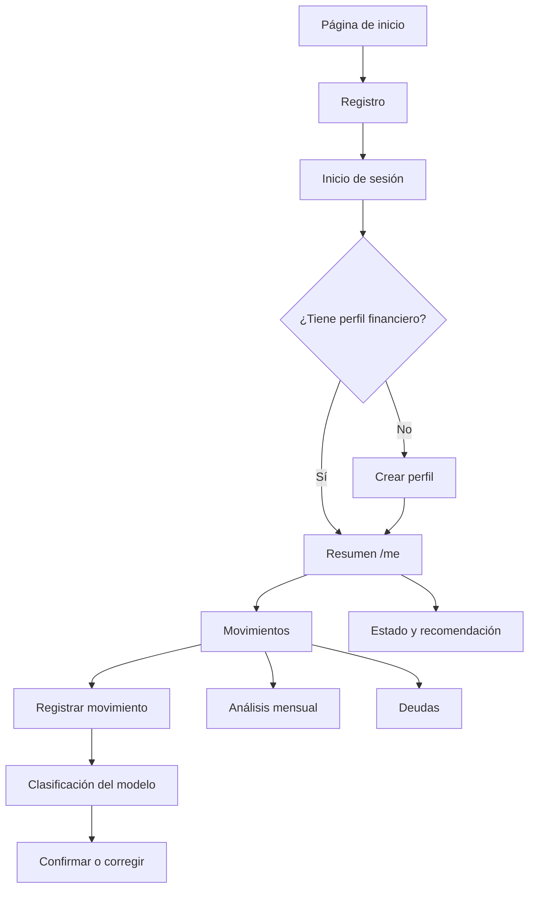

# Frontend de referencia de FinCoach

Esta carpeta contiene la interfaz web para demostrar el flujo de datos del MVP de FinCoach. Su función es mostrar cómo consumir la API, qué información esperan los modelos y cómo presentar sus resultados.

## ¿Qué permite probar?

- Creación y actualización del perfil financiero.
- Visualización de la clasificación del usuario y su confianza.
- Registro, clasificación, corrección y confirmación de movimientos.
- Clasificación de gastos como fijos o variables.
- Resumen financiero del mes.
- Comparación entre el mes actual y el anterior.
- Análisis mensual con paginación y exportación CSV.
- Registro y seguimiento de deudas.
- Visualización del estado financiero y las recomendaciones generadas por los modelos.

## Tecnologías

| Tecnología | Uso |
|---|---|
| Angular 22 | Aplicación web y enrutamiento |
| TypeScript | Lógica, contratos y tipado de respuestas |
| Tailwind CSS 4 | Estilos y diseño adaptable |
| Chart.js | Gráficas de confianza, distribución y evolución |
| ng2-charts | Integración de Chart.js con Angular |
| RxJS | Manejo de solicitudes y respuestas asíncronas |
| Formularios reactivos | Validación y envío de datos |
| Angular Signals | Estado local de las pantallas |

La aplicación utiliza componentes standalone y carga diferida mediante el enrutador de Angular.

## Ubicación del proyecto

La aplicación Angular se encuentra en:

```text
front/
├── README.md
└── fincoach/
    ├── public/
    ├── src/
    ├── angular.json
    ├── package.json
    ├── package-lock.json
    └── proxy.conf.json
```

Todos los comandos siguientes deben ejecutarse dentro de `front/fincoach/`.

## Requisitos

- Node.js en una versión compatible con Angular 22.
- npm.
- La API de FinCoach ejecutándose en el puerto `8000`.

Las versiones de las dependencias están fijadas por `package.json` y `package-lock.json`.

## Instalación

Desde la raíz del proyecto:

```bash
cd front/fincoach
npm ci
```

`npm ci` instala exactamente las versiones registradas en `package-lock.json`. Si se modifica deliberadamente alguna dependencia, se debe utilizar `npm install` para actualizar también el archivo de bloqueo.

## Ejecución local

Primero se debe iniciar la API desde otra terminal:

```bash
cd back/fincoach_api
source venv/bin/activate
python manage.py runserver 0.0.0.0:8000
```

Después se inicia Angular:

```bash
cd front/fincoach
npm start
```

La aplicación queda disponible en:

```text
http://localhost:4200/
```

El comando `npm start` utiliza el proxy definido en `proxy.conf.json`, por lo que las solicitudes a `/api` son redirigidas durante el desarrollo a `http://localhost:8000`.

### Probar desde otro dispositivo

Para acceder desde un celular conectado a la misma red:

```bash
npm start -- --host 0.0.0.0
```

Luego se abre en el celular la dirección IP local del computador con el puerto `4200`, por ejemplo:

```text
http://192.168.1.20:4200/
```

El backend también debe estar ejecutándose con `0.0.0.0:8000`. El proxy de Angular continúa enviando las solicitudes al backend que corre en el mismo computador.

## Comandos principales

| Comando | Función |
|---|---|
| `npm start` | Inicia el servidor de desarrollo |
| `npm start -- --host 0.0.0.0` | Permite probar desde otros dispositivos de la red |
| `npm run build` | Genera la compilación de producción en `dist/` |
| `npm test` | Ejecuta las pruebas unitarias con Vitest |
| `npm run watch` | Compila en modo desarrollo y observa cambios |

## Flujo principal del usuario



## Rutas de la aplicación

| Ruta | Acceso | Pantalla |
|---|---|---|
| `/` | Público | Página informativa de FinCoach |
| `/register` | Público | Registro de usuario |
| `/login` | Invitado | Inicio de sesión |
| `/profile` | Autenticado | Creación del perfil financiero |
| `/me` | Autenticado | Resumen financiero principal |
| `/edit-profile` | Autenticado | Consulta y actualización del perfil |
| `/transactions` | Autenticado | Movimientos, nuevos créditos y accesos al análisis |
| `/monthly-analysis` | Autenticado | Análisis paginado de un mes |
| `/debts` | Autenticado | Estado, cuotas y evolución de las deudas |

Las rutas protegidas utilizan `authGuard`. La ruta de inicio de sesión utiliza `guestGuard` para enviar a `/me` a un usuario que ya tiene una sesión válida. Las rutas desconocidas vuelven a la página de inicio.

## Pantallas principales

### Inicio

Presenta el propósito de FinCoach, las capacidades demostradas por la propuesta y los accesos al registro o inicio de sesión.

### Registro e inicio de sesión

El registro solicita nombre, apellido, correo, contraseña, confirmación de contraseña y aceptación del tratamiento de datos. Al finalizar, envía al usuario a iniciar sesión.

El inicio de sesión valida correo y contraseña contra la API. Si la sesión ya existe, el usuario es enviado al resumen `/me`.

### Perfil financiero

El formulario reúne información estructurada para el modelo de conocimiento del usuario:

- Ingreso mensual neto.
- Hábito de ahorro.
- Nivel y tipos de deuda declarados.
- Actividad principal y modalidad de ingreso.
- Actividad e ingreso adicionales.
- Próxima meta.
- Hobbies.
- Responsabilidad financiera.

`/profile` crea el perfil y `/edit-profile` consulta y actualiza la información existente. La vista de edición presenta además la clasificación, la ocupación CUOC, la confianza, el alcance del MVP, los hobbies reconocidos y el criterio ético.

### Resumen `/me`

Es la pantalla principal después de completar el perfil. Presenta:

- Confianza de la clasificación del usuario.
- Ingreso total, gastos fijos, gastos variables y disponible del mes.
- Distribución de ingresos fijos y variables.
- Distribución de gastos fijos y variables.
- Comparación del mes actual con el anterior.
- Estado financiero calculado.
- Factores, motivos, guardas y recomendación disponible.

Cuando no existe un periodo anterior comparable, la interfaz muestra `Sin base` en lugar de calcular una variación engañosa.

### Movimientos

Muestra los últimos diez movimientos y un resumen limitado al mes actual. Desde esta pantalla se puede:

- Registrar un ingreso o egreso.
- Solicitar su clasificación al modelo.
- Revisar las categorías más probables.
- Confirmar o corregir la categoría y la regularidad.
- Asociar un pago confirmado con una deuda cuando corresponde.
- Registrar un nuevo crédito.
- Abrir el análisis mensual o el seguimiento de deudas.

La confirmación del usuario forma parte del flujo. Una sugerencia del modelo no se presenta como clasificación definitiva hasta que sea confirmada o corregida.

### Análisis mensual

Permite seleccionar un mes y muestra:

- Las cuatro categorías de gasto más frecuentes.
- Totales de ingresos, gastos y balance.
- Movimientos confirmados del periodo.
- Paginación de siete registros por página.
- Descarga del periodo como archivo CSV.

El mes seleccionado se envía tanto al resumen del dashboard como al endpoint de análisis mensual.

### Deudas

Presenta:

- Deuda total pendiente.
- Cuota mensual total.
- Fecha estimada para terminar de pagar.
- Deudas activas y su progreso.
- Estado de pago de la cuota correspondiente al mes.
- Evolución proyectada del saldo mediante Chart.js.

Los valores de tasa, cuota, saldo, interés y proyección provienen de la API. El frontend no mantiene tasas financieras quemadas en los componentes.

## Integración con la API

La URL base se define en los archivos:

```text
src/environments/environment.ts
src/environments/environment.development.ts
```

Actualmente ambos utilizan:

```typescript
apiUrl: '/api/v1'
```

Los servicios de `src/app/core/api/` centralizan los contratos y solicitudes:

| Servicio | Responsabilidad |
|---|---|
| `profile-api.ts` | Crear, consultar y actualizar el perfil financiero |
| `transaction-api.ts` | Listar, registrar, clasificar y confirmar movimientos |
| `dashboard-api.ts` | Consultar dashboard, análisis mensual y exportar CSV |
| `debt-api.ts` | Registrar y consultar deudas |
| `financial-analysis-api.ts` | Ejecutar el análisis financiero integral |
| `recommendation-api.ts` | Consultar el estado y la recomendación actual |

### Endpoints consumidos

| Método | Endpoint | Uso |
|---|---|---|
| `POST` | `/api/v1/auth/register/` | Registrar usuario |
| `POST` | `/api/v1/auth/login/` | Iniciar sesión |
| `GET` | `/api/v1/auth/me/` | Validar sesión y consultar usuario |
| `POST` | `/api/v1/auth/logout/` | Cerrar sesión |
| `POST` | `/api/v1/profiles/` | Crear perfil financiero |
| `GET` | `/api/v1/profiles/me/` | Consultar el perfil propio |
| `PATCH` | `/api/v1/profiles/me/` | Actualizar el perfil propio |
| `GET` | `/api/v1/transactions/` | Listar movimientos |
| `POST` | `/api/v1/transactions/` | Registrar movimiento |
| `POST` | `/api/v1/transactions/{id}/classify/` | Clasificar movimiento |
| `PATCH` | `/api/v1/transactions/{id}/confirm/` | Confirmar o corregir clasificación |
| `GET` | `/api/v1/dashboard/` | Consultar resumen del mes |
| `GET` | `/api/v1/monthly-analysis/` | Consultar análisis mensual paginado |
| `GET` | `/api/v1/monthly-analysis/export/` | Descargar CSV del mes |
| `GET` | `/api/v1/debts/` | Consultar deudas y evolución |
| `POST` | `/api/v1/debts/` | Registrar deuda |
| `POST` | `/api/v1/financial-analysis/` | Ejecutar análisis integral |
| `GET` | `/api/v1/recommendations/` | Consultar estado y recomendación |

## Autenticación y seguridad

El frontend no almacena contraseñas ni tokens de autenticación en `localStorage` o `sessionStorage`.

El flujo utiliza la cookie de sesión emitida por el backend:

- El navegador recibe la cookie después de un inicio de sesión correcto.
- `HttpOnly` evita que el código JavaScript pueda leer su contenido.
- El interceptor utiliza `withCredentials: true` en las solicitudes a la API.
- Las solicitudes `POST`, `PUT`, `PATCH` y `DELETE` incluyen `X-FinCoach-Request: 1`.
- El backend valida la sesión, la vigencia y el encabezado de protección.
- Al cerrar sesión, el servidor invalida la sesión y elimina la cookie.

`X-FinCoach-Request` no es un token de sesión ni identifica al usuario. Es una capa de protección para las operaciones que cambian información.

Para que el flujo funcione, el navegador debe permitir la cookie de sesión del mismo sitio. En desarrollo, el proxy mantiene frontend y API bajo el origen de Angular desde la perspectiva del navegador.

## Organización del código

```text
src/app/
├── core/
│   ├── api/                 Servicios y contratos HTTP
│   ├── auth/                Estado y operaciones de autenticación
│   ├── guards/              Protección de rutas
│   └── interceptors/        Credenciales y encabezados de la API
├── features/
│   ├── auth/                Login y registro
│   ├── dashboard/           Resumen financiero principal
│   ├── debts/               Seguimiento de deudas
│   ├── landing/             Página pública
│   ├── monthly-analysis/    Análisis mensual y exportación
│   ├── profile/             Creación y edición del perfil
│   └── transactions/        Movimientos y confirmación
├── shared/
│   ├── components/          Logo y estados reutilizables
│   ├── directives/          Comportamientos visuales compartidos
│   └── layout/              Header, footer, sidebar y estructura privada
├── app.config.ts
└── app.routes.ts
```

Existen carpetas reservadas para `onboarding` y `recommendations`, pero actualmente no tienen una ruta activa. El perfil se construye en `/profile` y la recomendación se presenta directamente dentro de `/me`.

## Estilos y gráficas

- Tailwind CSS se procesa mediante PostCSS y `.postcssrc.json`.
- Los estilos globales se encuentran en `src/styles.css`.
- La paleta visual sigue los verdes, fondos cálidos y tonos auxiliares usados por el equipo.
- Las imágenes públicas se encuentran en `public/images/`.
- Chart.js se registra en `app.config.ts` y se consume mediante `ng2-charts`.
- Las pantallas incluyen ajustes para escritorio y dispositivos móviles.

## Compilación para producción

```bash
npm run build
```

Angular genera los archivos optimizados dentro de `dist/`. En producción, el servidor o proxy inverso debe:

- Servir la aplicación Angular.
- Redirigir `/api/v1/` hacia la API de FinCoach.
- Utilizar HTTPS.
- Conservar el manejo seguro de cookies definido por el backend.
- Devolver `index.html` para las rutas del frontend cuando se recarga una pantalla.

`proxy.conf.json` solo se utiliza durante el desarrollo con `ng serve` y no configura por sí mismo un despliegue productivo.

## Pruebas y validación

Para ejecutar las pruebas unitarias:

```bash
npm test
```

Para verificar que la aplicación compila:

```bash
npm run build
```

Además de las pruebas automatizadas, el flujo funcional debe comprobar como mínimo:

1. Registro y redirección al login.
2. Inicio y cierre de sesión.
3. Bloqueo de rutas privadas sin sesión.
4. Creación y edición del perfil.
5. Registro, clasificación, corrección y confirmación de un movimiento.
6. Separación de gastos fijos y variables.
7. Cambio de mes y paginación del análisis.
8. Descarga del CSV correspondiente al mes elegido.
9. Registro y seguimiento de una deuda.
10. Visualización del estado y la recomendación con evidencia suficiente e insuficiente.

## Problemas frecuentes

### La interfaz abre, pero las solicitudes fallan

Verificar que la API esté ejecutándose en `http://localhost:8000` y que Angular se haya iniciado mediante `npm start`, ya que este comando activa el proxy configurado.

### La API responde que la sesión es inválida o expiró

Iniciar sesión nuevamente y comprobar que el navegador no esté bloqueando la cookie. No se debe crear ni pegar manualmente un token en el frontend.

### Los cambios de la API no aparecen

Confirmar que los contratos de respuesta continúen coincidiendo con las interfaces ubicadas en `src/app/core/api/`. Si cambia un nombre, tipo o estructura, se debe actualizar el servicio y el componente que consume esa respuesta.

### La aplicación funciona en el computador, pero no en el celular

Ejecutar Angular y Django con `0.0.0.0`, utilizar la IP local del computador y verificar que ambos dispositivos estén conectados a la misma red.

## Alcance de esta implementación

Este frontend demuestra una forma posible de integrar los resultados del equipo de datos. Los estados, porcentajes y recomendaciones provienen de la API. La interfaz se encarga de solicitar, validar y presentar la información.